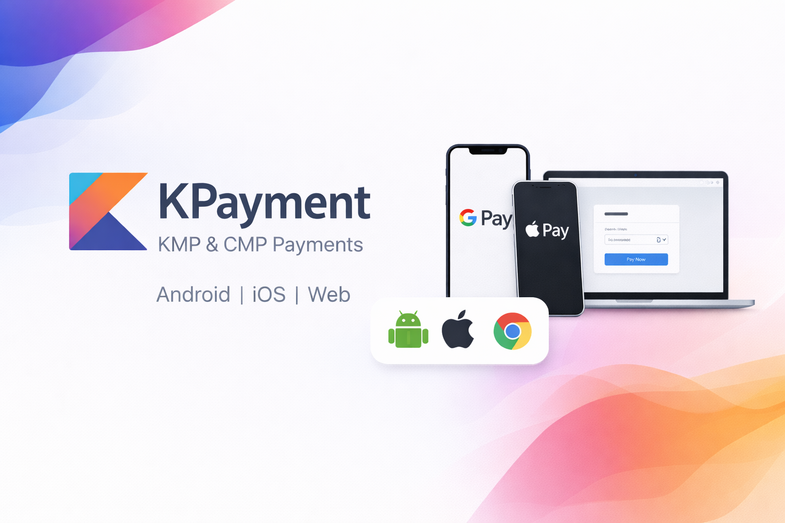

<div align="center">



### *One API. Three Platforms. Google Pay & Apple Pay.*

[](https://central.sonatype.com/artifact/com.kttipay/kpayment-core)
[](LICENSE)
[](https://kotlinlang.org)
[](https://www.jetbrains.com/lp/compose-multiplatform/)
[](https://github.com/kttipay/KPayment)

[Quickstart](#-quickstart) • [Installation](#-installation) • [Samples](#-samples) • [Documentation](#table-of-contents) • [](https://deepwiki.com/kttipay/KPayment)

</div>

---

## Overview

A **Kotlin Multiplatform** payment library with **Compose Multiplatform** UI components for Google Pay and Apple Pay across Android, iOS, and Web. One API, shared types, reactive availability detection, and platform-native payment buttons.

<details>
<summary><strong>📑 Table of Contents</strong></summary>

- [🚀 Quickstart](#-quickstart)
- [📱 Platform Support](#-platform-support)
- [✨ Why KPayment?](#-why-kpayment)
- [💻 Show Me The Code](#-show-me-the-code)
- [📦 Installation](#-installation)
  - [Add Maven Central Repository](#add-maven-central-repository)
  - [Add Dependencies](#add-dependencies)
  - [Platform-Specific Setup](#platform-specific-setup)
- [🏃 Quick Start](#-quick-start)
  - [Android](#android)
  - [iOS](#ios)
  - [Web](#web)
- [⚙️ Configuration](#-configuration)
  - [Google Pay Configuration](#google-pay-configuration)
  - [Apple Pay Configuration](#apple-pay-configuration)
- [🎯 Usage Examples](#-usage-examples)
  - [Check Payment Capability](#check-payment-capability)
  - [Handle Payment Results](#handle-payment-results)
  - [Track Payment State](#track-payment-state)
  - [PaymentManager API](#paymentmanager-api)
- [🚨 Error Handling](#-error-handling)
  - [Error Types](#error-types)
  - [Error Handling Best Practices](#error-handling-best-practices)
- [📚 Module Details](#-module-details)
  - [payment-core](#payment-core)
  - [payment-mobile](#payment-mobile)
  - [payment-web](#payment-web)
- [🪵 Logging](#-logging)
- [🧪 Testing](#-testing)
- [🎨 Samples](#-samples)
- [⭐ Star History](#-star-history)
- [🤝 Contributing](#-contributing)
- [📄 License](#-license)

</details>

## 🚀 Quickstart

Get started with KPayment in 5 minutes:

1. **Add the dependency** to your project from [Maven Central](https://central.sonatype.com/artifact/com.kttipay/kpayment-core)
2. **Configure your payment providers** (Google Pay, Apple Pay, or both)
3. **Add a payment button** using our Compose Multiplatform components
4. **Launch payments** and handle results with our type-safe API

```kotlin
// Create a payment manager
val manager = rememberMobilePaymentManager(config)

// Check availability
val isReady by manager.observeAvailability(currentNativePaymentProvider())
    .collectAsState(initial = false)

// Launch payment
val launcher = rememberNativePaymentLauncher { result ->
    when (result) {
        is PaymentResult.Success -> handleSuccess(result.token)
        is PaymentResult.Error -> handleError(result)
        is PaymentResult.Cancelled -> handleCancellation()
    }
}

PaymentButton(enabled = isReady, onClick = { launcher.launch("10.00") })
```

**Next Steps:**
- [Installation Guide](#-installation) - Add KPayment to your project
- [Quick Start](#-quick-start) - Platform-specific examples
- [Sample Apps](#-samples) - See complete working examples

## 📱 Platform Support

| Platform | Google Pay | Apple Pay | Compose UI |
|----------|------------|-----------|------------|
| Android  | ✅         | ❌        | ✅         |
| iOS      | ❌         | ✅        | ✅         |
| Web (JS) | ✅         | ✅*       | ✅         |
| WASM     | ✅         | ✅*       | ✅         |

*Apple Pay on Web requires Safari and a merchant validation endpoint.

### Requirements

**Android:**
- Minimum SDK: 26
- Target SDK: 36
- Compile SDK: 36
- Google Play Services Wallet: 19.5.0+

**iOS:**
- Deployment target is set by your host app
- Apple Pay requires a physical device and a valid merchant ID

**Web:**
- Modern browsers with ES6 support
- Apple Pay requires Safari and domain validation

**Build Environment:**
- Kotlin: 2.3.x
- Java: 21
- Gradle: 8.13+

## ✨ Why KPayment?

- **Cross-Platform** - Single codebase for Android, iOS, and Web
- **Type-Safe** - Shared configuration and model types across all targets
- **Reactive** - Capability detection via Kotlin `Flow` and `StateFlow`
- **Thread-Safe** - Atomic state management prevents duplicate payment launches
- **Compose Native** - First-class Compose Multiplatform payment buttons and launchers

## 💻 Show Me The Code

### Basic Payment Flow

<details>
<summary><strong>Android / iOS (Compose)</strong></summary>

```kotlin
val config = MobilePaymentConfig(
    environment = PaymentEnvironment.Development,
    googlePay = GooglePayConfig(
        merchantId = "YOUR_MERCHANT_ID",
        merchantName = "Your Store",
        gateway = "stripe",
        gatewayMerchantId = "YOUR_GATEWAY_ID"
    ),
    applePayMobile = ApplePayMobileConfig(
        merchantId = "merchant.com.yourcompany.app",
        base = ApplePayBaseConfig(merchantName = "Your Store")
    )
)

@Composable
fun PaymentScreen() {
    val manager = rememberMobilePaymentManager(config)
    val isReady by manager.observeAvailability(currentNativePaymentProvider())
        .collectAsState(initial = false)

    PaymentManagerProvider(manager) {
        val launcher = rememberNativePaymentLauncher { result ->
            when (result) {
                is PaymentResult.Success -> println("Token: ${result.token}")
                is PaymentResult.Error -> println("Error: ${result.message}")
                is PaymentResult.Cancelled -> println("Cancelled")
            }
        }

        PaymentButton(
            theme = NativePaymentTheme.Dark,
            type = NativePaymentType.Pay,
            enabled = isReady,
            radius = 12.dp,
            onClick = { launcher.launch("10.00") }
        )
    }
}
```

</details>

<details>
<summary><strong>Web (JS/WASM)</strong></summary>

```kotlin
val config = WebPaymentConfig(
    environment = PaymentEnvironment.Development,
    googlePay = GooglePayConfig(
        merchantId = "YOUR_MERCHANT_ID",
        merchantName = "Your Store",
        gateway = "stripe",
        gatewayMerchantId = "YOUR_GATEWAY_ID"
    ),
    applePayWeb = ApplePayWebConfig(
        base = ApplePayBaseConfig(merchantName = "Your Store"),
        merchantValidationEndpoint = "https://example.com/apple-pay/validate",
        baseUrl = "https://example.com",
        domain = "example.com"
    )
)

@Composable
fun PaymentScreen() {
    val manager = rememberWebPaymentManager(config)

    PaymentManagerProvider(manager) {
        val googlePay = rememberGooglePayWebLauncher { result ->
            // Handle result
        }

        val applePay = rememberApplePayWebLauncher { result ->
            // Handle result
        }

        Button(onClick = { googlePay.launch("10.00") }) {
            Text("Pay with Google Pay")
        }

        Button(onClick = { applePay.launch("10.00") }) {
            Text("Pay with Apple Pay")
        }
    }
}
```

</details>

### Capability Detection

```kotlin
// Reactive: Observe availability changes (recommended)
val isReady by manager.observeAvailability(PaymentProvider.GooglePay)
    .collectAsState(initial = false)

Button(enabled = isReady, onClick = { launcher.launch("10.00") }) {
    Text("Pay with Google Pay")
}

// Explicit check when needed
val capabilities = manager.checkCapabilities()
if (capabilities.canPayWith(PaymentProvider.GooglePay)) {
    launcher.launch("10.00")
}
```

### Error Handling

```kotlin
when (val result = paymentResult) {
    is PaymentResult.Success -> {
        // Send token to your backend
        processPayment(result.token)
    }
    is PaymentResult.Error -> {
        when (result.reason) {
            PaymentErrorReason.NetworkError -> showNetworkError()
            PaymentErrorReason.NotAvailable -> showAlternativePayment()
            PaymentErrorReason.Timeout -> retryPayment()
            else -> showGenericError(result.message)
        }
    }
    is PaymentResult.Cancelled -> {
        // User cancelled - no action needed
    }
}
```

See [full examples in Quick Start](#-quick-start) and [comprehensive guides below](#table-of-contents).

## 📦 Installation

### Add Maven Central Repository

Ensure Maven Central is in your repository list (usually already configured):

```kotlin
dependencyResolutionManagement {
    repositories {
        mavenCentral()
    }
}
```

### Add Dependencies

<details>
<summary><strong>Version Catalog (Recommended)</strong></summary>

Add to your `libs.versions.toml`:

```toml
[versions]
kpayment = "0.1.0"

[libraries]
kpayment-core = { module = "com.kttipay:kpayment-core", version.ref = "kpayment" }
kpayment-mobile = { module = "com.kttipay:kpayment-mobile", version.ref = "kpayment" }
kpayment-web = { module = "com.kttipay:kpayment-web", version.ref = "kpayment" }
```

Then in your `build.gradle.kts`:

```kotlin
kotlin {
    sourceSets {
        commonMain.dependencies {
            implementation(libs.kpayment.core)
        }

        androidMain.dependencies {
            implementation(libs.kpayment.mobile)
        }

        iosMain.dependencies {
            implementation(libs.kpayment.mobile)
        }

        jsMain.dependencies {
            implementation(libs.kpayment.web)
        }

        wasmJsMain.dependencies {
            implementation(libs.kpayment.web)
        }
    }
}
```

</details>

<details>
<summary><strong>Gradle DSL</strong></summary>

Add the KPayment dependencies directly to your `build.gradle.kts`:

```kotlin
kotlin {
    sourceSets {
        commonMain.dependencies {
            implementation("com.kttipay:kpayment-core:0.1.0")
        }

        androidMain.dependencies {
            implementation("com.kttipay:kpayment-mobile:0.1.0")
        }

        iosMain.dependencies {
            implementation("com.kttipay:kpayment-mobile:0.1.0")
        }

        jsMain.dependencies {
            implementation("com.kttipay:kpayment-web:0.1.0")
        }

        wasmJsMain.dependencies {
            implementation("com.kttipay:kpayment-web:0.1.0")
        }
    }
}
```

</details>

### Platform-Specific Setup

#### Android

No additional configuration required. Google Play Services Wallet is included as a dependency.

#### iOS

1. **Add Apple Pay Capability:**
   - In Xcode, select your target
   - Go to "Signing & Capabilities"
   - Click "+ Capability" and add "Apple Pay"
   - Select your merchant ID

2. **Configure Merchant ID:**
   - Create a merchant ID in your [Apple Developer account](https://developer.apple.com/account/resources/identifiers/list/merchant)
   - Format: `merchant.com.yourcompany.yourapp`

#### Web

**For Apple Pay on Web:**
- Register your domain with Apple
- Implement merchant validation endpoint on your backend
- Host domain verification file

See [Apple Pay on the Web documentation](https://developer.apple.com/documentation/apple_pay_on_the_web)

## 🏃 Quick Start

Amounts are decimal strings (for example, `"10.00"`).

### Android

```kotlin
val config = MobilePaymentConfig(
    environment = PaymentEnvironment.Development,
    googlePay = GooglePayConfig(
        merchantId = "YOUR_MERCHANT_ID",
        merchantName = "Your Store",
        gateway = "stripe",
        gatewayMerchantId = "YOUR_GATEWAY_ID"
    ),
    applePayMobile = null
)

@Composable
fun PaymentScreen() {
    val manager = rememberMobilePaymentManager(config)
    val isReady by manager.observeAvailability(currentNativePaymentProvider())
        .collectAsState(initial = false)

    PaymentManagerProvider(manager) {
        val launcher = rememberNativePaymentLauncher { result ->
            // handle PaymentResult.Success, PaymentResult.Error, PaymentResult.Cancelled
        }

        PaymentButton(
            theme = NativePaymentTheme.Dark,
            type = NativePaymentType.Pay,
            enabled = isReady,
            radius = 12.dp,
            onClick = { launcher.launch("10.00") }
        )
    }
}
```

### iOS

```kotlin
val config = MobilePaymentConfig(
    environment = PaymentEnvironment.Development,
    googlePay = null,
    applePayMobile = ApplePayMobileConfig(
        merchantId = "merchant.com.yourcompany.app",
        base = ApplePayBaseConfig(merchantName = "Your Store")
    )
)

@Composable
fun PaymentScreen() {
    val manager = rememberMobilePaymentManager(config)
    val isReady by manager.observeAvailability(currentNativePaymentProvider())
        .collectAsState(initial = false)

    PaymentManagerProvider(manager) {
        val launcher = rememberNativePaymentLauncher { result ->
            // handle PaymentResult.Success, PaymentResult.Error, PaymentResult.Cancelled
        }

        PaymentButton(
            theme = NativePaymentTheme.Dark,
            type = NativePaymentType.Pay,
            enabled = isReady,
            radius = 12.dp,
            onClick = { launcher.launch("10.00") }
        )
    }
}
```

### Web

Use `createWebPaymentManager(config)` outside Compose if you are not using Compose UI.

```kotlin
val config = WebPaymentConfig(
    environment = PaymentEnvironment.Development,
    googlePay = GooglePayConfig(
        merchantId = "YOUR_MERCHANT_ID",
        merchantName = "Your Store",
        gateway = "stripe",
        gatewayMerchantId = "YOUR_GATEWAY_ID"
    ),
    applePayWeb = ApplePayWebConfig(
        base = ApplePayBaseConfig(merchantName = "Your Store"),
        merchantValidationEndpoint = "https://example.com/apple-pay/validate",
        baseUrl = "https://example.com",
        domain = "example.com"
    )
)

@Composable
fun PaymentScreen() {
    val manager = rememberWebPaymentManager(config)

    PaymentManagerProvider(manager) {
        val googlePay = rememberGooglePayWebLauncher { result ->
            when (result) {
                is PaymentResult.Success -> println("Token: ${result.token}")
                is PaymentResult.Error -> println("Error: ${result.message}")
                is PaymentResult.Cancelled -> println("Cancelled")
            }
        }

        val applePay = rememberApplePayWebLauncher { result ->
            when (result) {
                is PaymentResult.Success -> println("Token: ${result.token}")
                is PaymentResult.Error -> println("Error: ${result.message}")
                is PaymentResult.Cancelled -> println("Cancelled")
            }
        }

        Button(onClick = { googlePay.launch("10.00") }) {
            Text("Pay with Google Pay")
        }

        Button(onClick = { applePay.launch("10.00") }) {
            Text("Pay with Apple Pay")
        }
    }
}
```

## ⚙️ Configuration

### Google Pay Configuration

```kotlin
val googlePay = GooglePayConfig(
    merchantId = "YOUR_MERCHANT_ID",
    merchantName = "Your Store",
    gateway = "stripe",
    gatewayMerchantId = "YOUR_GATEWAY_ID",
    allowedCardNetworks = setOf(
        GooglePayCardNetwork.VISA,
        GooglePayCardNetwork.MASTERCARD
    ),
    allowedAuthMethods = GooglePayAuthMethod.DEFAULT,
    currencyCode = "AUD",
    countryCode = "AU"
)
```

#### Advanced Google Pay Options

```kotlin
val googlePay = GooglePayConfig(
    allowCreditCards = true,
    assuranceDetailsRequired = true
)
```

- `allowCreditCards`: Set to `true` to allow credit card transactions (default: `false`)
- `assuranceDetailsRequired`: Set to `true` to request additional cardholder verification (default: `false`)

### Apple Pay Configuration

```kotlin
val appleBase = ApplePayBaseConfig(
    merchantName = "Your Store",
    supportedNetworks = setOf(
        ApplePayNetwork.VISA,
        ApplePayNetwork.MASTERCARD
    ),
    merchantCapabilities = setOf(
        ApplePayMerchantCapability.CAPABILITY_3DS,
        ApplePayMerchantCapability.CAPABILITY_DEBIT
    ),
    currencyCode = "AUD",
    countryCode = "AU"
)

val applePayMobile = ApplePayMobileConfig(
    merchantId = "merchant.com.yourcompany.app",
    base = appleBase
)

val applePayWeb = ApplePayWebConfig(
    base = appleBase,
    merchantValidationEndpoint = "https://example.com/apple-pay/validate",
    baseUrl = "https://example.com",
    domain = "example.com"
)
```

## 🎯 Usage Examples

### Check Payment Capability

```kotlin
// Reactive: Observe availability changes (most common)
val isReady by manager.observeAvailability(PaymentProvider.GooglePay)
    .collectAsState(initial = false)

Button(
    enabled = isReady,
    onClick = { launcher.launch("10.00") }
) {
    Text("Pay with Google Pay")
}

// Explicit check when needed
val capabilities = manager.checkCapabilities()
if (capabilities.canPayWith(PaymentProvider.GooglePay)) {
    launcher.launch("10.00")
}

// Handle detailed capability status
val capabilities = manager.checkCapabilities()
when (capabilities.googlePay) {
    CapabilityStatus.Ready -> { /* show button */ }
    CapabilityStatus.NotConfigured -> { /* missing config */ }
    CapabilityStatus.NotSupported -> { /* platform not supported */ }
    CapabilityStatus.Checking -> { /* loading */ }
    is CapabilityStatus.Error -> { /* handle error: ${error.reason} */ }
}
```

### Handle Payment Results

```kotlin
when (val result = paymentResult) {
    is PaymentResult.Success -> {
        val token = result.token
        // Send token to your backend for processing
    }
    is PaymentResult.Error -> {
        when (result.reason) {
            PaymentErrorReason.Timeout -> {}
            PaymentErrorReason.NetworkError -> {}
            PaymentErrorReason.DeveloperError -> {}
            PaymentErrorReason.InternalError -> {}
            PaymentErrorReason.NotAvailable -> {}
            PaymentErrorReason.AlreadyInProgress -> {}
            PaymentErrorReason.SignInRequired -> {}
            PaymentErrorReason.ApiNotConnected -> {}
            PaymentErrorReason.ConnectionSuspendedDuringCall -> {}
            PaymentErrorReason.Interrupted -> {}
            PaymentErrorReason.Unknown -> {}
        }
    }
    is PaymentResult.Cancelled -> {}
}
```

### Track Payment State

The launcher exposes `isProcessing: StateFlow<Boolean>` to track whether a payment is in progress:

```kotlin
val launcher = rememberNativePaymentLauncher { result -> /* handle */ }
val isProcessing by launcher.isProcessing.collectAsState()

PaymentButton(
    enabled = isReady && !isProcessing,
    onClick = { launcher.launch("10.00") }
)
```

### PaymentManager API

| Method | Type | Description |
|--------|------|-------------|
| `config` | Property | The payment configuration |
| `checkCapabilities()` | `suspend` | Check current payment capabilities from platform SDKs |
| `observeCapabilities()` | `Flow<PaymentCapabilities>` | Reactively observe full payment capabilities |
| `observeAvailability(provider)` | `Flow<Boolean>` | Reactively observe specific provider availability |

```kotlin
// Reactive UI for full capabilities
val capabilities by manager.observeCapabilities()
    .collectAsState(initial = PaymentCapabilities.initial)

when (capabilities.googlePay) {
    CapabilityStatus.Ready -> ShowPaymentButton()
    CapabilityStatus.Checking -> ShowLoading()
    else -> ShowNotAvailable()
}

// Reactive UI for single provider (convenience)
val isReady by manager.observeAvailability(PaymentProvider.GooglePay)
    .collectAsState(initial = false)

Button(enabled = isReady, onClick = { launcher.launch("10.00") }) {
    Text("Pay")
}

// Explicit capability check
val capabilities = manager.checkCapabilities()
if (capabilities.canPayWith(PaymentProvider.GooglePay)) {
    launcher.launch("10.00")
}
```

## 🚨 Error Handling

All payment results come through the `PaymentResult` sealed class:

```kotlin
when (result) {
    is PaymentResult.Success -> sendTokenToBackend(result.token)
    is PaymentResult.Error -> handleError(result.reason, result.message)
    is PaymentResult.Cancelled -> { /* user cancelled, no action needed */ }
}
```

### Error Reasons

| Reason | When | Suggested Action |
|--------|------|------------------|
| `Timeout` | Request timed out | Retry after a delay |
| `NetworkError` | No connectivity | Check network, retry |
| `DeveloperError` | Bad config or invalid amount | Fix configuration |
| `InternalError` | Platform SDK failure | Retry with backoff |
| `NotAvailable` | Payment method unavailable | Show alternative |
| `AlreadyInProgress` | Duplicate launch | Disable button via `launcher.isProcessing` |
| `SignInRequired` | User not signed in | Prompt sign-in |
| `ApiNotConnected` | SDK not initialized | Re-initialize manager |
| `ConnectionSuspendedDuringCall` | App backgrounded mid-call | Retry on resume |
| `Interrupted` | Operation interrupted | Show retry dialog |
| `Unknown` | Unclassified error | Log and show generic message |

### Tips

- Check `observeAvailability()` before showing the payment button.
- Use `launcher.isProcessing` to disable the button while a payment is in flight.
- `Cancelled` is not an error — don't show error UI for it.

## 📚 Module Details

KPayment is organized into three main modules:

```
KPayment/
├── payment-core/      Shared interfaces, models, and types
├── payment-mobile/    Android + iOS implementations
└── payment-web/       Web (JS/WASM) implementations
```

### payment-core

Shared abstractions used by all platforms:

- `PaymentManager` - unified API for capability checks and configuration
- Config models (`GooglePayConfig`, `ApplePayBaseConfig`, `MobilePaymentConfig`, `WebPaymentConfig`)
- Result types (`PaymentResult`) and tokens (`GooglePayToken`, `ApplePayToken`)
- Reactive capability observation via `StateFlow` and `Flow`

See `payment-core/README.md` for a focused overview.

### payment-mobile

Android + iOS implementation with Compose helpers:

- `createMobilePaymentManager(...)`
- `rememberMobilePaymentManager(...)`
- `PaymentButton` and `rememberNativePaymentLauncher(...)`

See `payment-mobile/README.md` for setup and platform-specific details.

### payment-web

Web implementation for JS/Wasm:

- `createWebPaymentManager(...)`
- `rememberWebPaymentManager(...)`
- `rememberGooglePayWebLauncher(...)` and `rememberApplePayWebLauncher(...)`

See `payment-web/README.md` for setup and platform-specific details.

## 🪵 Logging

KPayment includes an optional logging system for debugging:

```kotlin
KPaymentLogger.enabled = true

KPaymentLogger.callback = object : KPaymentLogCallback {
    override fun onLog(event: LogEvent) {
        println("[${event.tag}] ${event.message}")
    }
}
```

By default, logging is **disabled** and will not interfere with your app's logging.

## 🧪 Testing

The library includes comprehensive unit tests:

```bash
./gradlew payment-core:jvmTest        # Core logic tests
./gradlew payment-web:jsTest          # Web platform tests
./gradlew payment-mobile:iosSimulatorArm64Test  # iOS tests
./gradlew payment-mobile:testAndroid  # Android tests
```

Test coverage includes:
- Result conversion and error mapping (Priority 1)
- Launcher state management and concurrency (Priority 2)
- Configuration validation
- Amount validation

## 🎨 Samples

KPayment includes complete sample applications demonstrating integration on all platforms:

- **[sampleMobile](./sampleMobile)** - Android + iOS KMP sample with:
  - Platform-specific payment button selection
  - Capability status display
  - Result handling with detailed logging
  - Setup instructions per platform

- **[sampleWeb](./sampleWeb)** - Web sample (JS/WASM) with:
  - Google Pay and Apple Pay web integration
  - Separate launchers for each provider
  - Error and success handling

Sample configurations:
- `sampleMobile/src/commonMain/kotlin/com/kttipay/kpayment/config/PaymentConfig.kt`
- `sampleWeb/src/webMain/kotlin/com/kttipay/kpayment/PaymentConfig.kt`

**Running Samples:**

```bash
# Android
./gradlew sampleMobile:installDebug

# iOS
cd iosApp && pod install
open iosApp.xcworkspace

# Web
./gradlew sampleWeb:jsBrowserDevelopmentRun
```

## ⭐ Star History

<div align="center">

[](https://www.star-history.com/#kttipay/KPayment&type=date&legend=top-left)

</div>

## 🤝 Contributing

We welcome contributions to KPayment! Here's how you can help:

### Reporting Issues

Found a bug or have a feature request? Please open an issue on [GitHub Issues](https://github.com/kttipay/KPayment/issues) with:
- Clear description of the issue or feature
- Platform and version information
- Steps to reproduce (for bugs)
- Expected vs actual behavior

### Pull Requests

1. Fork the repository
2. Create a feature branch (`git checkout -b feature/amazing-feature`)
3. Make your changes with tests
4. Run tests: `./gradlew check`
5. Commit your changes following conventional commits
6. Push to your fork and submit a pull request

### Development Setup

```bash
git clone https://github.com/kttipay/KPayment.git
cd KPayment
./gradlew build
```

**Requirements:**
- JDK 21
- Android SDK (for Android targets)
- Xcode (for iOS targets)
- Node.js (for web targets)

## 📄 License

```
Copyright 2025 KTTipay

Licensed under the Apache License, Version 2.0 (the "License");
you may not use this file except in compliance with the License.
You may obtain a copy of the License at

    http://www.apache.org/licenses/LICENSE-2.0

Unless required by applicable law or agreed to in writing, software
distributed under the License is distributed on an "AS IS" BASIS,
WITHOUT WARRANTIES OR CONDITIONS OF ANY KIND, either express or implied.
See the License for the specific language governing permissions and
limitations under the License.
```

See [LICENSE](LICENSE) file for the full license text.

---

<div align="center">

**Built with ❤️ using Kotlin Multiplatform**

[⭐ Star us on GitHub](https://github.com/kttipay/KPayment) • [📖 DeepWiki](https://deepwiki.com/kttipay/KPayment) • [🐛 Report Bug](https://github.com/kttipay/KPayment/issues)

</div>
