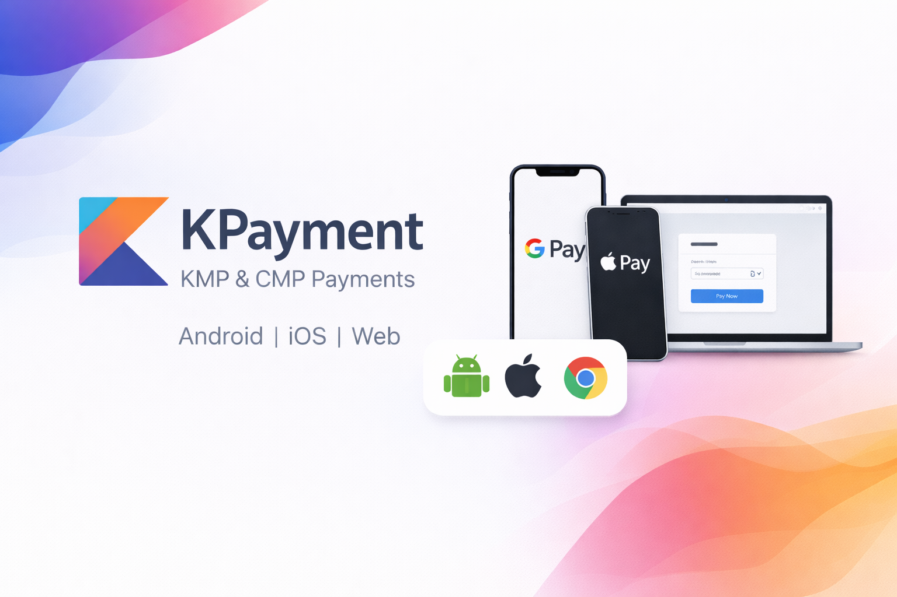

<div align="center">



### *One API. Three Platforms. Google Pay & Apple Pay.*

[](https://central.sonatype.com/artifact/com.kttipay/kpayment-core)
[](LICENSE)
[](https://kotlinlang.org)
[](https://www.jetbrains.com/lp/compose-multiplatform/)
[](https://github.com/kttipay/KPayment)

[Quickstart](#-quickstart) • [Installation](#-installation) • [Samples](#-samples) • [Documentation](#-module-details) • [](https://deepwiki.com/kttipay/KPayment)

</div>

---

## Overview

A **Kotlin Multiplatform** payment library with **Compose Multiplatform** UI components for Google Pay and Apple Pay across Android, iOS, and Web. One API, shared types, reactive availability detection, and platform-native payment buttons.

## 📱 Platform Support

| Platform | Google Pay | Apple Pay | Compose UI |
|----------|------------|-----------|------------|
| Android  | ✅         | ❌        | ✅         |
| iOS      | ❌         | ✅        | ✅         |
| Web (JS) | ✅         | ✅        | ✅         |
| WASM     | ✅         | ✅        | ✅         |

Apple Pay on Web works natively in Safari. On other browsers (Chrome, Firefox, Edge), the Apple Pay JS SDK enables a QR code flow where users scan with their iPhone to pay (iOS 18+).

## 🚀 Quickstart

```kotlin
// Mobile (Android / iOS)
val manager = rememberMobilePaymentManager(config)
val launcher = rememberNativePaymentLauncher { result ->
    when (result) {
        is PaymentResult.Success -> handleSuccess(result.token)
        is PaymentResult.Error -> handleError(result)
        is PaymentResult.Cancelled -> { /* no action */ }
    }
}
PaymentButton(enabled = isReady, onClick = { launcher.launch("10.00") })

// Web (JS / WASM)
val manager = rememberWebPaymentManager(config)
val applePay = rememberApplePayWebLauncher { result -> /* handle */ }
val googlePay = rememberGooglePayWebLauncher { result -> /* handle */ }
Button(onClick = { applePay.launch("10.00") }) { Text("Apple Pay") }
```

## 📦 Installation

Ensure Maven Central is in your repositories, then add dependencies:

```toml
# libs.versions.toml
[versions]
kpayment = "0.1.0"

[libraries]
kpayment-core = { module = "com.kttipay:kpayment-core", version.ref = "kpayment" }
kpayment-mobile = { module = "com.kttipay:kpayment-mobile", version.ref = "kpayment" }
kpayment-web = { module = "com.kttipay:kpayment-web", version.ref = "kpayment" }
```

```kotlin
kotlin {
    sourceSets {
        commonMain.dependencies { implementation(libs.kpayment.core) }
        androidMain.dependencies { implementation(libs.kpayment.mobile) }
        iosMain.dependencies { implementation(libs.kpayment.mobile) }
        jsMain.dependencies { implementation(libs.kpayment.web) }
        wasmJsMain.dependencies { implementation(libs.kpayment.web) }
    }
}
```

### Platform Setup

**Android:** No additional setup. Google Play Services Wallet is included.

**iOS:** Add "Apple Pay" capability in Xcode and configure your [merchant ID](https://developer.apple.com/account/resources/identifiers/list/merchant).

**Web:** For cross-browser Apple Pay, add the JS SDK to your HTML `<head>`:
```html
<script src="https://applepay.cdn-apple.com/jsapi/1.latest/apple-pay-sdk.js"
        crossorigin="anonymous"></script>
```

## ⚙️ Configuration

```kotlin
// Google Pay
val googlePay = GooglePayConfig(
    merchantId = "YOUR_MERCHANT_ID",
    merchantName = "Your Store",
    gateway = "stripe",
    gatewayMerchantId = "YOUR_GATEWAY_ID"
)

// Apple Pay (Mobile)
val applePayMobile = ApplePayMobileConfig(
    merchantId = "merchant.com.yourcompany.app",
    base = ApplePayBaseConfig(merchantName = "Your Store")
)

// Apple Pay (Web)
val applePayWeb = ApplePayWebConfig(
    base = ApplePayBaseConfig(merchantName = "Your Store"),
    merchantValidationEndpoint = "https://example.com/apple-pay/validate",
    baseUrl = "https://example.com",
    domain = "example.com",
    enableJsSdk = true // cross-browser QR code flow (default)
)
```

## 🎯 Capability Detection

```kotlin
// Reactive (recommended)
val isReady by manager.observeAvailability(PaymentProvider.GooglePay)
    .collectAsState(initial = false)

Button(enabled = isReady, onClick = { launcher.launch("10.00") }) { Text("Pay") }

// Explicit check
val capabilities = manager.checkCapabilities()
when (capabilities.googlePay) {
    CapabilityStatus.Ready -> { /* show button */ }
    CapabilityStatus.Checking -> { /* loading */ }
    is CapabilityStatus.Error -> { /* handle error */ }
    else -> { /* not available */ }
}
```

## 🚨 Error Handling

```kotlin
when (result) {
    is PaymentResult.Success -> sendTokenToBackend(result.token)
    is PaymentResult.Error -> {
        when (result.reason) {
            PaymentErrorReason.NetworkError -> showNetworkError()
            PaymentErrorReason.NotAvailable -> showAlternativePayment()
            PaymentErrorReason.AlreadyInProgress -> { /* disable button via launcher.isProcessing */ }
            else -> showGenericError(result.message)
        }
    }
    is PaymentResult.Cancelled -> { /* no action needed */ }
}
```

| Reason | Suggested Action |
|--------|------------------|
| `NetworkError` | Check network, retry |
| `NotAvailable` | Show alternative payment |
| `AlreadyInProgress` | Disable button via `launcher.isProcessing` |
| `DeveloperError` | Fix configuration |
| `Timeout` | Retry after delay |
| `SignInRequired` | Prompt sign-in |

## 📚 Module Details

```
KPayment/
├── payment-core/      Shared interfaces, models, config, result types
├── payment-mobile/    Android (Google Pay) + iOS (Apple Pay) implementations
└── payment-web/       Web JS/WASM (Google Pay + Apple Pay) implementations
```

Each module has its own README with platform-specific details:
- [`payment-core/README.md`](payment-core/README.md)
- [`payment-mobile/README.md`](payment-mobile/README.md)
- [`payment-web/README.md`](payment-web/README.md) — includes Apple Pay JS SDK button options and cross-browser QR flow

## 🪵 Logging

```kotlin
KPaymentLogger.enabled = true
KPaymentLogger.callback = object : KPaymentLogCallback {
    override fun onLog(event: LogEvent) { println("[${event.tag}] ${event.message}") }
}
```

## 🎨 Samples

- **[sampleMobile](./sampleMobile)** — Android + iOS with native payment buttons and capability detection
- **[sampleWeb](./sampleWeb)** — Web with Google Pay, Apple Pay JS SDK button, and custom Compose button side-by-side

```bash
./gradlew sampleMobile:installDebug              # Android
cd iosApp && pod install && open iosApp.xcworkspace  # iOS
./gradlew sampleWeb:wasmJsBrowserDevelopmentRun   # Web
```

## ⭐ Star History

<div align="center">

[](https://www.star-history.com/#kttipay/KPayment&type=date&legend=top-left)

</div>

## 🤝 Contributing

1. Fork the repo and create a feature branch
2. Make changes with tests (`./gradlew check`)
3. Submit a pull request

[Report a bug](https://github.com/kttipay/KPayment/issues) | [Development setup](https://github.com/kttipay/KPayment)

## 📄 License

Apache 2.0. See [LICENSE](LICENSE).

---

<div align="center">

**Built with ❤️ using Kotlin Multiplatform**

[⭐ Star us on GitHub](https://github.com/kttipay/KPayment) • [📖 DeepWiki](https://deepwiki.com/kttipay/KPayment) • [🐛 Report Bug](https://github.com/kttipay/KPayment/issues)

</div>
